# Dementia Friendly Website

This is the code repository for the Dementia Friendly Indianapolis website. Below are useful notes and information about the website that we may need to refer back to later.

## Table of Contents

- [Links](#links-to-preview-site)
- [About Project](#about-project)
- [Connecting to FlyWheel](#flywheel)
  - [Sftp Access and Uploads](#sftp--ftp-access-and-uploads)
  - [Connecting to Local](#local)
  - [DeployHQ](#deployhq)
- [Project Structure](#project-structure)
  - [Pages](#pages)
  - [Styles](#styles)
    - [Sass/SCSS](#sass)
    - [Installing SASS](#installing-sass)
- [Authors](#authors)

## Links to Preview Site

- **[Wordpress Site](https://dfindy.flywheelsites.com/)**

- [Github Pages](https://pjiceskull.github.io/Dementia_Friendly)

Design Protoype

- [Figma Prototype](https://www.figma.com/design/dfYjQrinWz1wNEav3O2ngM/DFIndy-Wireframe?node-id=0-1&t=8IxyJq4GGsu6haqw-1)

## About Project

This project is to establish a website for the **Dementia Friendly Indianapolis initiative**. Dementia Friendly Indianapolis (started
in 2023) is an initiative focused on creating an inclusive environment for those living with dementia and their care partners through
**C.A.R.E (community events, awareness, resources, and education)**.

We are a part of the [Dementia Friendly Indiana Community network](https://www.dementiafriendsindiana.org/), among 13 other communities in Indiana. For more information about what the DFA network is, check out [www.dfamerica.org](https://dfamerica.org/). The initiative is governed by a cross-sector action team with multiple organizations involved, led by **CICOA’s Dementia Programs Team**.

DFIndy hosts various events such as memory cafes (a safe space for someone living with dementia and their care partner to gather and
connect with others), business trainings, and an annual Fall Festival.

The **goal** of this website is to:

- Have an SEO-friendly homepage.
- An About Us section where visitors can learn what the initiative is.
- An event schedule and registration for events.
- A Resources page for links and documents.
- A contact form that individuals can fill out to learn more.

### About CICOA

[CICOA](https://cicoa.org/) is the statewide administrator of Dementia Friends Indiana, a 60-minute education session designed
to inform people of how to interact and support someone living with dementia. DFIndy is a SEPARATE, COMMUNITY initiative that
involves various projects and education materials. We hope having an additional website for DFIndy will help reduce the confusion
between the two.

## Flywheel

### SFTP / FTP Access and Uploads

[Tutorial on SFTP Access and Uploads for Flywheel](https://getflywheel.com/wordpress-support/sftp-access-and-uploads/)

#### Configuration Settings

| Mode      | SFTP (not regular FTP)   |
| --------- | ------------------------ |
| Host      | sftp.flywheelsites.com   |
| Port:     | 22                       |
| Username: | Your Flywheels Username. |
| Password: | Your flywheels password. |

Here are the basic steps you’ll need to do to access your Flywheels server.

1. Use FTP client of choice.

   I tend to use WinSCP as my FTP client, so I’ll use it as an example. However, this process should work with other FTP clients, such as Cyberduck and Filezilla.

2. Create a new Session or Connection. It should look something like this:

   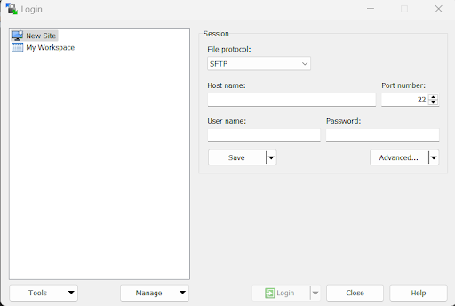

   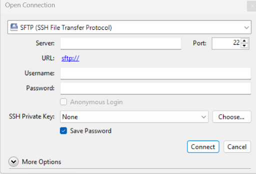

   Make sure the file protocol at the top is set to **SFTP**.

   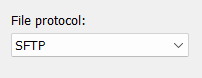

   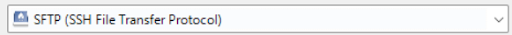

3. Under the Hostname or Server Name, put **sftp.flywheelsites.com**

   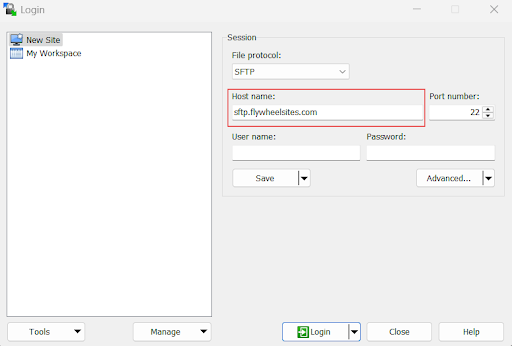

4. Under the **Username** field, put the **username** you used for Flywheel.

   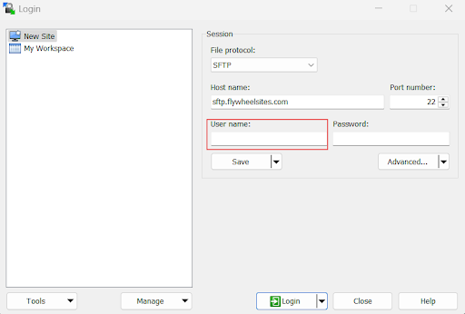

5. Likewise in the password field, enter the password you used for your flywheel account. For certain clients (like WinSCP), there’s a good chance, they’ll ask you to login first and then enter your password for authentication.

   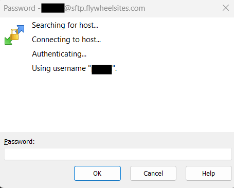

6. If you successfully log in, you should see a folder containing the files for your WordPress website.

### Local

[Follow this help document on connecting to Local](https://localwp.com/help-docs/local-features/local-connect/)

1. Download and Install Local

2. Connecting to Flywheels

   - In Local navigate to the “Connect” tab in the side-bar on the left

   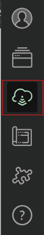

   - Click the “Log in to Your Host” or “My Host” buttons.

   - Select the “Connect to a platform” option, which will take you to the “Connected accounts” section of Local’s Preferences.

   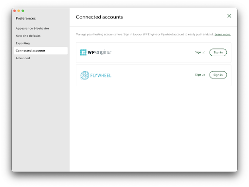

   - In the flywheels option, Select the sign-in link next to Flywheel.

   - It will then open a browser window and you’ll be prompted to either sign in to your flywheel account or create a new one.

### DeployHQ

[Article about using DeployHQ](http://DeployHQ)

## Project Structure

This section of the readme will be going over the folder structure of our project.
For building the website, we used the following languages below:

- **HTML** - The base markup language that we'll be using to build the website.
- **CSS** - For mainly styling the website's visuals and it's overall responsivess to other devices. Most CSS work is done through SASS for organizational purposes and then compiled into one file.
- **JavaScript** - The programming language that we'll use to implement Backend features and behaviors to the website.

Other Software/Tools/Languages we used:

- **Sass**
  <!-- - **Webpack** -->
  <!-- - **jQuery** -->

### Pages

Most of the content and information for each web page will be found in the `pages` folder in the `dist` folder.

### Styles

Naturally, we will be styling the website in typical CSS fashion. However, the **catch** is that we'll won't working in the `css` folder when we're creating our styles.

#### SASS

Most of where we'll be doing our styling work is in the **scss** folder where we'll be using SASS files. [SASS](https://sass-lang.com/) is a preprocessor scripting language that is interpreted or compiled into CSS files. Sass is completely **compatible** with all versions of CSS along with sporting other features such as **nesting**, **mixins**, and **inheritance** to name a few. Another reasoning we'll using SASS is for organizational purposes. Instead working in one large `styles.css` file, the styling work can be split up into different SCSS files. Then all of the SCSS file are compiled into one `style.css` file in the `css` folder.

Of course, before you begin working with SCSS you need to understand how they're set up. If you plan on working in a new scss file, make sure to **import** it in the `styles.scss` file in the `scss` folder. Create the file you're planning to work on and use the `@import` code to link the file like this:

```scss
@import "fileName.scss";
```

In the `scss/styles.scss` files, it would be preferable if you import your at the end of the file, to avoid causing conflicts with the order of files being imported.

After you are done working in your SASS file, compile all of your changes into the `styles.css` file by playing your `compile:sass` NPM script.

#### Installing SASS

1. To install SASS run this cmd in your terminal:

   ```cmd
   npm install sass
   ```

   or

   ```cmd
   npm install sass --save-dev
   ```

   `--save-dev` is used to save the package for development purposes. It's typically only installed if someone clones your source repository first and then runs `npm install` in it.

2. In your `package.JSON` file, inside your `"scripts"` sections insert this line:

   ```json
   "compile:sass": "sass styles/scss/styles.scss style.css -w"
   ```

   Make the file paths of your `styles.scss` file and `styles.css` file are correct or you will get an error. The `styles.css` file path in particular will be we will be compiling all our styles.

3. Run your NPM Scripts

   At the bottom of the page, open your **NPM SCRIPTS** section.

   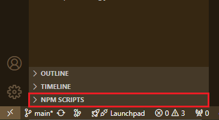

If you don't see a **NPM Scripts** section:

- At the top of your **explorer section** (where your files are listed),
- Click to 3 dots,
- Make sure NPM Scripts is checked

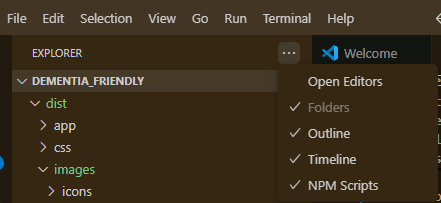

In your **NPM Scripts**, you should see the scripts you made in your `package.json` file and of those script you should see one saying, `compile:sass`.

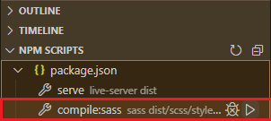

Click the play button next to your `compile:sass` script to run it. It will open up a terminal to watch all of your changes and edits.

<!-- ### Lib

This folder is where we will holding the file for [jQuery](https://jquery.com/). This file is the compressed, production version of jQuery.

### SRC / Backend

The `src` folder is where we will working with my javascript files. Similar to our css, we will be using a compiler to bundle all our javascript into one file. The name of this compiler is [Webpack.js](https://webpack.js.org/).

#### Installing Webpack

1. Install webpack as a dev dependency:
   In a new terminal, type the cmd:

   ```cmd
   npm install webpack --save-dev
   ```

2. Install webpack-cli:
   In your terminal, type the cmd:

   ```cmd
   npm install webpack-cli --save-dev
   ```

3. Add Webpack Script
   If you don't have it, add a NPM script in your `package.json` to run **webpack**.
   In your `package.json`, inside the `"scripts"` section, add the line:

   ```json
   "build-webpack": "webpack"
   ```

4. Run NPM Script
   In the NPM SCRIPTS section of your explorer window, click the play button next `build-webpack` to compile your javascript code.

_Add any programming languages, libraries, or frameworks you used in the project under the **readme file**._ -->

## Authors

- [Pierce Issah](https://www.linkedin.com/in/pierceissah/)
- [Lucas Wolf](https://www.linkedin.com/in/lucas--wolf/)
- [Nate Osborne](https://www.linkedin.com/in/natedosborne/)
